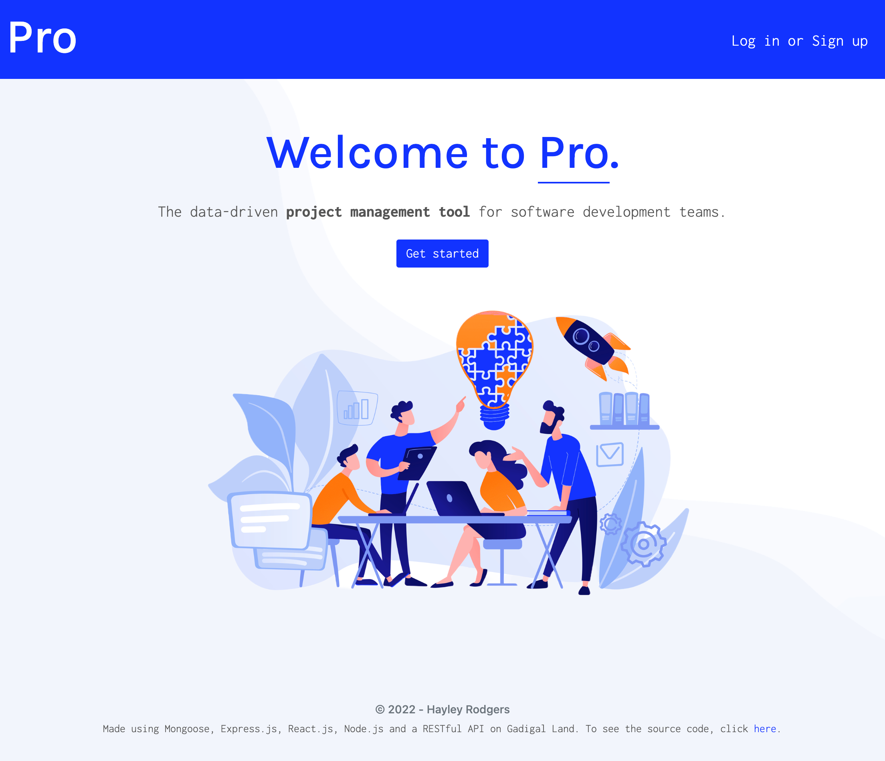
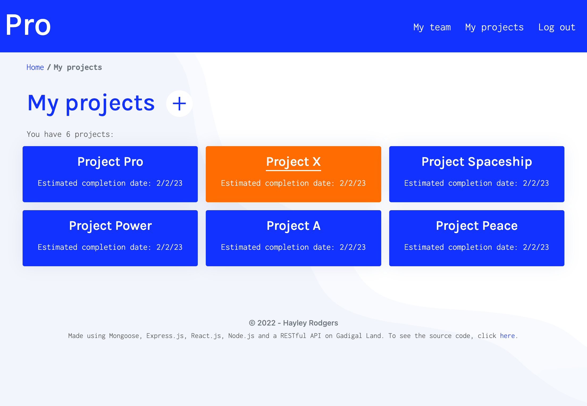
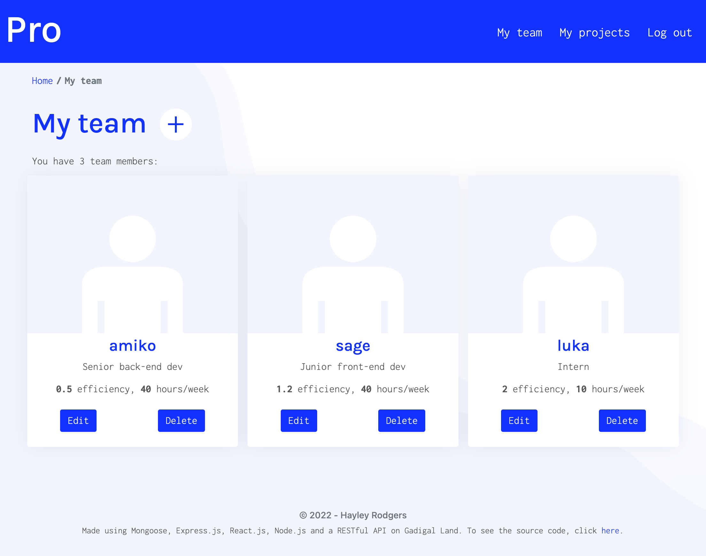
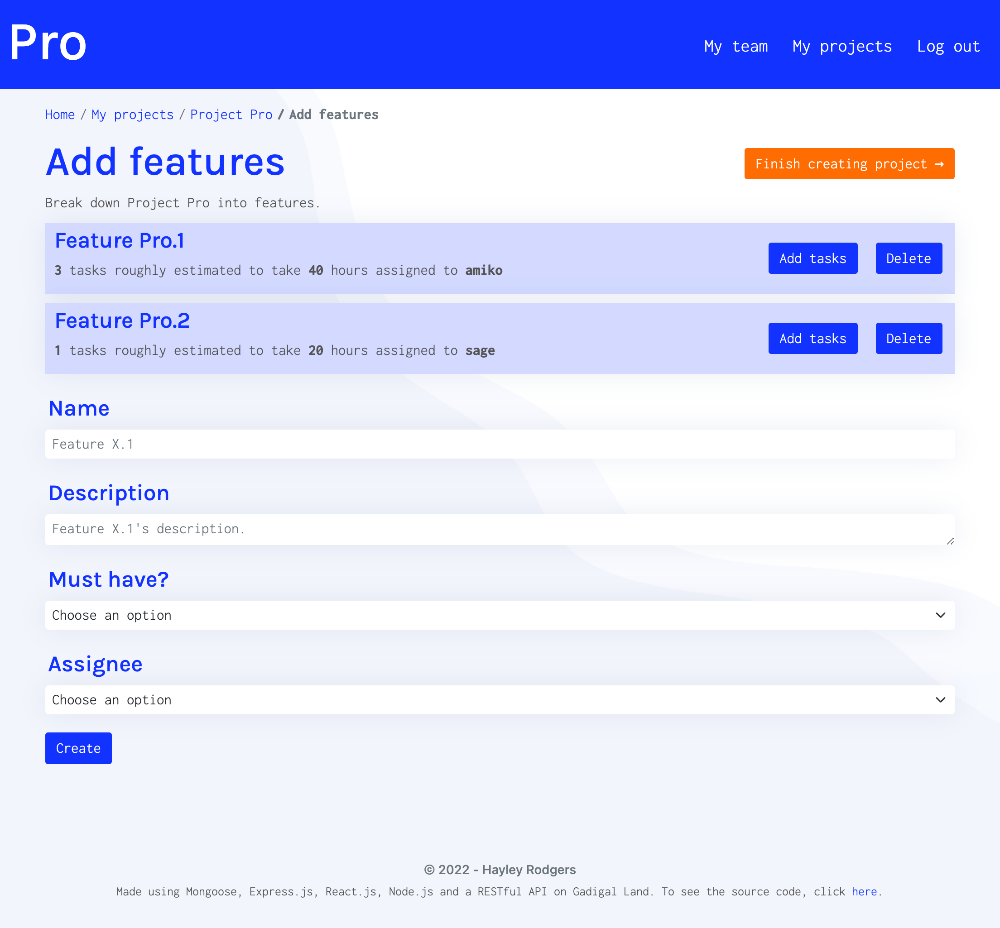

# project-management-tool

# Pawfect Match

## Table of Contents

* [Description](#description)
* [Access](#access)
* [Installation](#installation)
* [Usage](#usage)
* [Credits](#credits)

## Description

My goal for this project was to build a scalable, user-focused MERN application that works with data to solve a real-world challenge.

### Concept

I created **Pro**, a data-driven project management tool for software development teams. 

Underscroping is the most common cause of bugs in software development

My motivation for creating this application was to

### User Story

```
AS A software development team manager
I WANT a data-driven project management tool
SO THAT I can accurately predict project completion timelines.
```

Currently, Pro achieves this by ___. Possible features that could be implemented in the future to improve the application include:


### Tools and Technologies Used

To create Pro, I used:
- React-Bootstrap
- Node.js 
- Express.js
- Bcrypt
- MongoDB
- Mongoose
- JSON Web Tokens
- Chart.js
- And, Heroku.

### Screenshots of Application









## Access

### Code Repository

The repository where the code is saved is on Github. To access it, click [here](https://github.com/hayleyarodgers/project-management-tool).

### Live Application

The application is deployed on Heroku. To access it, click [here](https://hayleyarodgers-pro.herokuapp.com/).

## Installation

To install necessary dependencies, run the following command:

```
npm i
```

## Usage

To use the application from the command line (after installing dependencies):
1. Open the root directory of the repository in your terminal or bash.
2. To view the complete application, enter ```npm run develop``` in the command line and go to the port on your local host. 
3. To interact with the server, enter ```npm run start```. 

Alternatively, to use the live application, click [here](https://hayleyarodgers-pro.herokuapp.com/).

## Credits
I used:
- [React](https://reactjs.org/) as my front end framework.
- [React-Bootstrap](https://react-bootstrap.github.io/getting-started/introduction/) for most of my CSS styling.
- [BootstrapMade](https://bootstrapmade.com/flexstart-bootstrap-startup-template/) for styling inspiration.
- A RESTful API with an [Express](https://expressjs.com/) server.
- [ReactDOM](https://reactjs.org/docs/react-dom.html) and [React Router](https://v5.reactrouter.com/web/guides/quick-start) to navigate through my front end.
- A [MongoDB](https://www.mongodb.com/) database. 
- [Mongoose](https://www.npmjs.com/package/mongoose) to connect and interact with my database.
- [bcrypt](https://www.npmjs.com/package/bcrypt) package to hash passwords.
- [JSON web tokens](https://www.npmjs.com/package/jsonwebtoken) and [jwt-decode]https://www.npmjs.com/package/jwt-decode) for authentication.
- [Chart.js](https://www.chartjs.org/docs/latest/), [react-chartjs-2](https://react-chartjs-2.js.org/), [date-fns](https://date-fns.org/) and [chartjs-adapter-date-fns](https://www.npmjs.com/package/chartjs-adapter-date-fns) to create charts.
- [This tutorial](https://blog.devgenius.io/using-chart-js-with-react-to-create-a-line-chart-showing-progress-over-time-3e34377b1391) to help me create charts.
- Images from [Freepik](http://www.freepik.com), one designed by stories and another designed by vectorjuice.