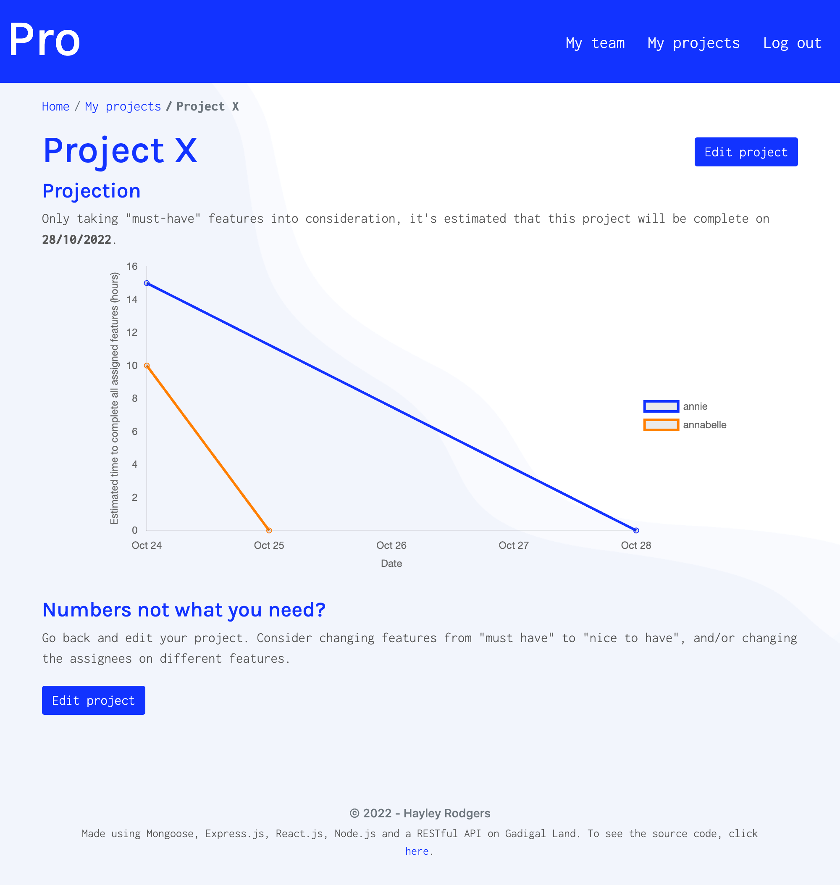

# project-management-tool

## Table of Contents

* [Description](#description)
* [Access](#access)
* [Installation](#installation)
* [Usage](#usage)
* [Credits](#credits)

## Description

My goal for this project was to build a scalable, user-focused MERN application that works with data to solve a real-world challenge.

### Concept

I created **Pro**, a data-driven project management tool for software development teams. 

After entering information about the people in your team and what they'll be working on, Pro produces an estimation for when a project will be complete. It also shows you when each person is expected to finish their part of the project, which can allow you to re-allocate people to different tasks to get a more even balance of work. 



### Motivation

My motivation for creating this application is to help software development team managers plan accurately and allocate resources effectively to prevent underscoping—which is the most common cause of bugs. In doing this, user experience will be improved as more realiable features will be shipped at more reliable times.

### User Story

```
AS A software development team manager
I WANT a data-driven project management tool
SO THAT I can accurately predict project completion timelines.
```

Currently, Pro achieves this by using data entered by the user to predict when their project might be complete.

In later interations, Pro will expand to become a comprehensive workflow management tool. 
- The UI for project creation will become more intuitive—ideally a one-page interface instead of forms being split across multiple pages.
- Instead of just being static placeholders, team members will have a separate user role and experience through the application. They will mark tasks as done, logging information about the task as they go.
- With this data, Pro will learn:
  - What team member's efficiencies are in practice
  - And, how long certain types of tasks tend to take.
- In turn, this will allow Pro to make more accurate estimations of project completion and potentially also suggestions of how to plan your projects to ensure success.

Other future directions include:
- Turning Pro into a PWA for offline use
- And, using Stripe to accept payments, eg. when the team gets above a certain number of members.

### Tools and Technologies Used

To create Pro, the key technologies I used were:
- React-Bootstrap
- Node.js 
- Express.js
- Bcrypt
- MongoDB
- Mongoose
- JSON Web Tokens
- Chart.js
- And, Heroku.

### Screenshots of Application


### Wireframes of Application

To see the wireframes for this project, see [here](./assets/wireframes/mvp/project-management-tool-mvp.pdf).

## Access

### Code Repository

The repository where the code is saved is on Github. To access it, click [here](https://github.com/hayleyarodgers/project-management-tool).

### Live Application

The application is deployed on Heroku. To access it, click [here](https://hayleyarodgers-pro.herokuapp.com/).

## Installation

To install necessary dependencies, run the following command:

```
npm i
```

## Usage

To use the application from the command line (after installing dependencies):
1. Open the root directory of the repository in your terminal or bash.
2. To view the complete application, enter ```npm run develop``` in the command line and go to the port on your local host. 
3. To interact with the server, enter ```npm run start```. 

Alternatively, to use the live application, click [here](https://hayleyarodgers-pro.herokuapp.com/).

## Credits
I used:
- [React](https://reactjs.org/) as my front end framework.
- [React-Bootstrap](https://react-bootstrap.github.io/getting-started/introduction/) for most of my CSS styling.
- [BootstrapMade](https://bootstrapmade.com/flexstart-bootstrap-startup-template/) for styling inspiration.
- A RESTful API with an [Express](https://expressjs.com/) server.
- [ReactDOM](https://reactjs.org/docs/react-dom.html) and [React Router](https://v5.reactrouter.com/web/guides/quick-start) to navigate through my front end.
- A [MongoDB](https://www.mongodb.com/) database. 
- [Mongoose](https://www.npmjs.com/package/mongoose) to connect and interact with my database.
- [bcrypt](https://www.npmjs.com/package/bcrypt) package to hash passwords.
- [JSON web tokens](https://www.npmjs.com/package/jsonwebtoken) and [jwt-decode](https://www.npmjs.com/package/jwt-decode) for authentication.
- [Chart.js](https://www.chartjs.org/docs/latest/), [react-chartjs-2](https://react-chartjs-2.js.org/), [date-fns](https://date-fns.org/) and [chartjs-adapter-date-fns](https://www.npmjs.com/package/chartjs-adapter-date-fns) to create charts.
- [This tutorial](https://blog.devgenius.io/using-chart-js-with-react-to-create-a-line-chart-showing-progress-over-time-3e34377b1391) to help me create charts.
- Images from [Freepik](http://www.freepik.com), one designed by stories and another designed by vectorjuice.